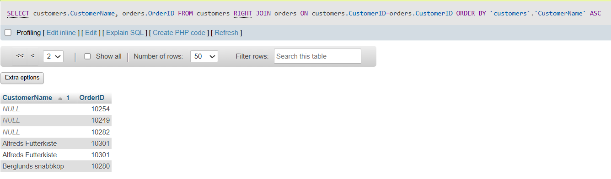

# SQL SELECT Statement

- Syntax

  ```
  SELECT column1, column2, ...
  FROM table_name;
  ```

- Demo Table:

  - Custmores Table:-
    

- Example:

  - Return Data from customers Table:-

    ```
    SELECT Address,City FROM customers;
    ```

- It will produce something like this:

  

# SQL SELECT DISTINCT Statement

- Syntax

  ```
  SELECT DISTINCT column1, column2, ...
  FROM table_name;
  ```

- Demo Table:

  - Custmores Table:-
    

- Example:

  - Select all the different countries from the "Customers" table:

    ```
    SELECT DISTINCT Country FROM Customers;
    ```

- It will produce something like this:

  

# SQL WHERE Clause

- Syntax

  ```
  SELECT column1, column2, ...
  FROM table_name
  WHERE condition;
  ```

- Demo Table:

  - Custmores Table:-
    

- Example:

  - Select all customers from Mexico: "Customers" table:

    ```
    SELECT * FROM Customers WHERE Country='Mexico';
    ```

- It will produce something like this:

  

# SQL ORDER BY Keyword

- Syntax

  ```
  SELECT column1, column2, ...
  FROM table_name
  ORDER BY column1, column2, ... ASC|DESC;
  ```

- Demo Table:

  - product Table:-
    

- Example:

  - Sort the products by price:

    ```
    SELECT * FROM Products
    ORDER BY Price;

    ```

- It will produce something like this:

  

# SQL AND Operator

- Syntax

  ```
  SELECT *
  FROM Customers
  WHERE Country = 'Spain' AND CustomerName LIKE 'G%';
  ```

- Demo Table:

  - Customer Table:-
    

- Example:

  - Select all customers from Mexico that Address start with M:

    ```
    SELECT *FROM Customers WHERE Country ='Mexico' AND Address LIKE 'M%';

    ```

- It will produce something like this:

  

# SQL OR Operator

- Syntax

  ```
  SELECT column1, column2, ...
  FROM table_name
  WHERE condition1 OR condition2 OR condition3 ...;
  ```

- Demo Table:

  - Customer Table:-
    

- Example:

  - Select all customers from Germany or Spain::

    ```
    SELECT * FROM Customers WHERE Country = 'Germany' OR Country = 'Spain';

    ```

- It will produce something like this:

  

# SQL NOT Operator

- Syntax

  ```
  SELECT column1, column2, ...
  FROM table_name
  WHERE NOT condition;
  ```

- Demo Table:

  - Customer Table:-
    

- Example:

  - Select only the customers that are NOT from Spain:

    ```
    SELECT * FROM Customers
    WHERE NOT Country = 'Spain';
    ```

- It will produce something like this:

  

# SQL NOT-LIKE Operator

- Syntax

  ```
  SELECT column1, column2, ...
  FROM table_name
  WHERE NOT condition;
  ```

- Demo Table:

  - Customer Table:-
    

- Example:

  - Select customers that does not start with the letter 'A':

    ```
    SELECT * FROM Customers
    WHERE CustomerName NOT LIKE 'A%';
    ```

- It will produce something like this:

  

# SQL NOT-BETWEEN Operator

- Syntax

  ```
  SELECT column1, column2, ...
  FROM table_name
  WHERE NOT condition;
  ```

- Demo Table:

  - Customer Table:-
    

- Example:

  - Select customers with a customerID not between 2 and 4:

    ```
    SELECT * FROM Customers WHERE CustomerID NOT BETWEEN 2 AND 4;
    ```

- It will produce something like this:

  

# SQL NOT IN Operator

- Syntax

  ```
  SELECT column1, column2, ...
  FROM table_name
  WHERE NOT condition;
  ```

- Demo Table:

  - Customer Table:-
    

- Example:

  - Select customers that are not from Paris or London:
    ```
    SELECT * FROM Customers
    WHERE City NOT IN ('Paris', 'London');
    ```

- It will produce something like this:

  

# SQL NOT Greater Than Operator

- Syntax

  ```
  SELECT column1, column2, ...
  FROM table_name
  WHERE NOT condition;
  ```

- Demo Table:

  - Customer Table:-
    

- Example:

  - Select customers that are not from Paris or London:
    ```
    SELECT * FROM Customers
    WHERE NOT CustomerID > 4;
    ```

- It will produce something like this:

  

# SQL INSERT INTO Operator

- Syntax

  ```
  INSERT INTO table_name (column1, column2, column3, ...)
  VALUES (value1, value2, value3, ...);
  or

  INSERT INTO table_name
  VALUES (value1, value2, value3, ...);
  ```

- Demo Table:

  - Insert Table:-
    

- Example:

  - The following SQL statement inserts a new record in the "Insert" table:
    ```
    INSERT INTO insert_table(CustomerName, ContactName, Address, City, PostalCode, Country)
    VALUES ('Cardinal', 'Tom B. Erichsen', 'Skagen 21', 'Stavanger', '4006', 'Norway');
    ```

- It will produce something like this:

  

# SQL Insert Data Only in Specified Columns Operator

- Syntax

  ```
  INSERT INTO table_name (column1, column2, column3, ...)
  VALUES (value1, value2, value3, ...);
  or

  INSERT INTO table_name
  VALUES (value1, value2, value3, ...);
  ```

- Demo Table:

  - Insert Table:-
    

- Example:

  - The following SQL statement will insert a new record, but only insert data in the "CustomerName", "City", and "Country" columns:
    ```
    INSERT INTO insert_table (CustomerName, City, Country)
    VALUES ('Cardinal', 'Stavanger', 'Norway');
    ```

- It will produce something like this:

  

# SQL Insert Multiple Rows Operator

- Syntax

  ```
  INSERT INTO table_name (column1, column2, column3, ...)
  VALUES (value1, value2, value3, ...);
  or

  INSERT INTO table_name
  VALUES (value1, value2, value3, ...);
  ```

- Demo Table:

  - Insert Table:-
    

- Example:

  - To insert multiple rows of data, we use the same INSERT INTO statement, but with multiple values:
    ```
    INSERT INTO insert_table (CustomerName, ContactName, Address, City, PostalCode, Country)
    VALUES
    ('Cardinal', 'Tom B. Erichsen', 'Skagen 21', 'Stavanger', '4006', 'Norway'),
    ('Greasy Burger', 'Per Olsen', 'Gateveien 15', 'Sandnes', '4306', 'Norway'),
    ('Tasty Tee', 'Finn Egan', 'Streetroad 19B', 'Liverpool', 'L1 0AA', 'UK');
    ```

- It will produce something like this:

  

# SQL NULL Values

- Syntax

  ```
  SELECT column_names
  FROM table_name
  WHERE column_name IS NULL;

  ```

- Demo Table:

  - Insert Table:-
    

- Example:

  - The following SQL lists all customers with a NULL value in the "customerID" field:
    ```
    SELECT CustomerName, ContactName, Address
    FROM insert_table
    WHERE customerID IS NULL;
    ```

- It will produce something like this:

  

# SQL IS NOT NULL Values

- Syntax

  ```
  SELECT column_names
  FROM table_name
  WHERE column_name IS NOT NULL;

  ```

- Demo Table:

  - Insert Table:-
    

- Example:

  - The following SQL lists all customers with a value in the "customerID" field:
    ```
    SELECT CustomerName, ContactName, Address
    FROM insert_table
    WHERE customerID IS NOT NULL;
    ```

- It will produce something like this:

  

# SQL UPDATE Statement

- Syntax

  ```
  UPDATE table_name
  SET column1 = value1, column2 = value2, ...
  WHERE condition;

  ```

- Demo Table:

  - Insert Table:-
    

- Example:

  - The following SQL statement updates the supplierID ,and price of (ProductID = 2):
    ```
    UPDATE products
    SET supplierID=2, price=15
    WHERE ProductID=2;
    ```

- It will produce something like this:

  

# SQL DELETE ALL Records

- Syntax

  ```
  DELETE FROM table_name;

  ```

- Demo Table:

  - Insert Table:-
    

- Example:

  - The following SQL statement deletes all rows in the "Customers" table, without deleting the table:
    ```
    DELETE FROM Customers;
    ```

- It will produce something like this:

  

# SQL TOP / LIMIT

- Syntax

  ```
  SELECT column_name(s)
  FROM table_name
  LIMIT number;

  or

  SELECT column_name(s)
  FROM table_name
  WHERE condition
  LIMIT number;

  ```

- Demo Table:

  - Insert Table:-
    

- Example:

  - Select the first 3 records of the Customers table:
    ```
    SELECT * FROM customers LIMIT 3;
    ```

- It will produce something like this:

  

# SQL TOP/LIMIT WITH WHERE CLAUSE

- Syntax

  ```
  SELECT column_name(s)
  FROM table_name
  LIMIT number;

  or

  SELECT column_name(s)
  FROM table_name
  WHERE condition
  LIMIT number;

  ```

- Demo Table:

  - Insert Table:-
    

- Example:

  - The following SQL statement shows the equivalent example for MySQL:
    ```
    SELECT * FROM Customers
    WHERE Country='Germany'
    LIMIT 3;
    ```

- It will produce something like this:

  

# SQL MIN() Functions (Aggregate Functions)

- Syntax

  ```
  SELECT MIN(column_name)
  FROM table_name;

  or

  SELECT MIN(column_name)
  FROM table_name
  WHERE condition;

  ```

- Demo Table:

  - Insert Table:-
    

- Example:

  - Find the lowest price in the Price column:
    ```
    SELECT MIN(Price) FROM Products;
    ```

- It will produce something like this:

  

# SQL MAX() Functions (Aggregate Functions)

- Syntax

  ```
  SELECT MAX(column_name)
  FROM table_name;

  or

  SELECT MAX(column_name)
  FROM table_name
  WHERE condition;

  ```

- Demo Table:

  - Insert Table:-
    

- Example:

  - Find the highest price in the Price column:
    ```
    SELECT MAX(Price) FROM Products;
    ```

- It will produce something like this:

  

  # SQL MAX() Functions SET Column Name (Aggregate Functions)

- Syntax

  ```
  SELECT MAX(column_name) AS column_name
  FROM table_name;

  or

  SELECT MAX(column_name) AS column_name
  FROM table_name
  WHERE condition;

  ```

- Demo Table:

  - Insert Table:-
    

- Example:

  - Find the highest price in the Price column using column Name:
    ```
    SELECT MAX(Price) AS MAxprice FROM Products;
    ```

- It will produce something like this:

  

# SQL Use MIN() with GROUP BY Functions AND SET Column Name (Aggregate Functions)

- Syntax

  ```
  SELECT MAX(column_name) AS column_name
  FROM table_name
  GROUP BY column_name;
  ```

- Demo Table:

  - Insert Table:-
    

- Example:

  - Find the highest price in the Price column using group by function and column Name:
    ```
    SELECT MAX(Price) AS SmallestPrice, CategoryID
    FROM Products
    GROUP BY CategoryID;
    ```

- It will produce something like this:

  

# SQL COUNT() Function

- Syntax

  ```
  SELECT COUNT(column_name)
  FROM table_name
  WHERE condition;
  ```

- Demo Table:

  - Insert Table:-
    

- Example:

  - Find the number of products where the ProductName is not null:
    ```
    SELECT COUNT(ProductName)
    FROM Products;
    ```

- It will produce something like this:

  

- Example:

  - Find the number of products where Price is higher than 20:
    ```
      SELECT COUNT(ProductID)
      FROM Products
      WHERE Price > 20;
    ```

- It will produce something like this:

  

- Example:

  - How many different prices are there in the Products table:
    ```
      SELECT COUNT(DISTINCT Price)
      FROM Products;
    ```

- It will produce something like this:

  

- Example:

  - Name the column "Number of records":
    ```
      SELECT COUNT(*) AS Numberofrecords
      FROM Products;
    ```

- It will produce something like this:

  

- Example:

  - Name the column "Number of records":
    ```
      SELECT COUNT(*) AS Numberofrecords, categoryID
      FROM Products
      GROUP BY categoryID;
    ```

- It will produce something like this:

  

# SQL SUM() Function

- Syntax

  ```
  SELECT SUM(column_name)
  FROM table_name

  or

  SELECT SUM(column_name)
  FROM table_name
  WHERE condition;
  ```

- Demo Table:

  - Insert Table:-
    

- Example:

  - Return the sum of all Quantity fields in the OrderDetails table:
    ```
    SELECT SUM(Quantity)
    FROM OrderDetails;
    ```

- It will produce something like this:

  

- Example:

  - Return the sum of the Quantity field for the product with ProductID 11:
    ```
    SELECT SUM(Quantity)
    FROM OrderDetails
    WHERE ProductId = 11;
    ```

- It will produce something like this:

  

- Example:

  -Here we use the SUM() function and the GROUP BY clause, to return the Quantity for each OrderID in the OrderDetails table:

  ```
  SELECT OrderID, SUM(Quantity) AS TotalQuantity
  FROM OrderDetails
  GROUP BY OrderID;
  ```

- It will produce something like this:

  

# SQL AVG() Function

- Syntax

  ```
  SELECT AVG(column_name)
  FROM table_name
  WHERE condition;
  ```

- Demo Table:

  - Insert Table:-
    

- Example:

  - Find the average price of all products:
    ```
    SELECT AVG(Price) FROM products;
    ```

- It will produce something like this:

  

- Example:

  - Return the average price of products in category 1:
    ```
    SELECT AVG(Price)
    FROM Products
    WHERE CategoryID = 1;
    ```

- It will produce something like this:

  

- Example:

  - Name the column "average price":
    ```
    SELECT AVG(Price) AS AveragePrice
    FROM Products;
    ```

- It will produce something like this:

  

- Example:

  - Return all products with a higher price than the average price:
    ```
    SELECT * FROM Products
    WHERE price > (SELECT AVG(price) FROM Products);
    ```

- It will produce something like this:

  

- Example:

  - return the average price for each category in the Products table:

    ```
    SELECT AVG(Price) AS AveragePrice, CategoryID
    FROM Products
    GROUP BY CategoryID;
    ```

- It will produce something like this:

  

# SQL LIKE Operator

- The LIKE operator is used in a WHERE clause to search for a specified pattern in a column.

  - The percent sign % represents zero, one, or multiple characters
  - The underscore sign \_ represents one, single character

- Syntax

  ```
  SELECT column1, column2, ...
  FROM table_name
  WHERE columnN LIKE pattern;
  ```

- Demo Table:

  - Insert Table:-
    

- Example:

  - Select all customers that starts with the letter "a":
    ```
    SELECT * FROM Customers
    WHERE CustomerName LIKE 'a%';
    ```

- It will produce something like this:

  

- Example:

  - Return all customers from a city that starts with 'L' followed by one wildcard character, then 'nd' and then two wildcard characters:
    ```
    SELECT * FROM Customers
    WHERE city LIKE 'L_nd__';
    ```

- It will produce something like this:

  

- Example:

  - Return all customers from a city that contains the letter 'L':
    ```
    SELECT * FROM Customers
    WHERE city LIKE '%L%';
    ```

- It will produce something like this:

  

- Example:

  - Return all customers that starts with 'La':
    ```
    SELECT * FROM Customers
    WHERE city LIKE 'La%';
    ```

- It will produce something like this:

  

- Example:

  - Return all customers that starts with 'a' or starts with 'b':
    ```
    SELECT * FROM Customers
    WHERE CustomerName LIKE 'a%' OR CustomerName LIKE 'b%';
    ```

- It will produce something like this:

  

- Example:

  - Return all customers that ends with 'a':
    ```
    SELECT * FROM Customers
    WHERE CustomerName LIKE '%a';
    ```

- It will produce something like this:

  

- Example:

  - Return all customers that starts with "a" and are at least 3 characters in length:
    ```
    SELECT * FROM Customers
    WHERE CustomerName LIKE 'a__%';
    ```

- It will produce something like this:

  

# SQL IN Operator

- The IN operator allows you to specify multiple values in a WHERE clause.

- The IN operator is a shorthand for multiple OR conditions.

- Syntax

  ```
  SELECT column_name(s)
  FROM table_name
  WHERE column_name IN (value1, value2, ...);
  ```

- Demo Table:

  - Insert Table:-
    

- Example:

  - Return all customers from 'Germany', 'France', or 'UK'
    ```
    SELECT * FROM Customers
    WHERE Country IN ('Germany', 'France', 'UK');
    ```

- It will produce something like this:

  

# SQL NOT-IN Operator

- Syntax

  ```
  SELECT column_name(s)
  FROM table_name
  WHERE column_name NOT IN (value1, value2, ...);
  ```

- Demo Table:

  - Insert Table:-
    

- Example:

  - Return all customers that are NOT from 'Germany', 'France', or 'UK':
    ```
    SELECT * FROM Customers
    WHERE Country NOT IN ('Germany', 'France', 'UK');
    ```

- It will produce something like this:

  

# SQL IN-Select Operator

- Syntax

  ```
  SELECT column_name(s)
  FROM table_name
  WHERE column_name NOT IN (value1, value2, ...);
  ```

- Demo Table:

  - Insert Table:-
    

  - Insert orders Table:-
    

- Example:

  - Return all customers that have an order in the Orders table:
    ```
    SELECT * FROM Customers
    WHERE CustomerID IN (SELECT CustomerID FROM Orders);
    ```

- It will produce something like this:

  

# SQL BETWEEN Operator

- Syntax

  ```
  SELECT column_name(s)
  FROM table_name
  WHERE column_name BETWEEN value1 AND value2;
  ```

- Demo Table:

  - Insert Table:-
    

- Example:

  - Selects all products with a price between 10 and 20:
    ```
    SELECT * FROM Products
    WHERE Price BETWEEN 10 AND 20;
    ```

- It will produce something like this:

  

# SQL BETWEEN with IN Operator

- Syntax

  ```
  SELECT column_name(s)
  FROM table_name
  WHERE column_name BETWEEN value1 AND value2;
  ```

- Demo Table:

  - Insert Table:-
    

- Example:

  - The following SQL statement selects all products with a price between 10 and 20. In addition, the CategoryID must be either 1,2
    ```
    SELECT * FROM Products
    WHERE Price BETWEEN 10 AND 20
    AND CategoryID IN (1,2);
    ```

- It will produce something like this:

  

# SQL BETWEEN Text Values

- Syntax

  ```
  SELECT column_name(s)
  FROM table_name
  WHERE column_name BETWEEN value1 AND value2;
  ```

- Demo Table:

  - Insert Table:-
    

- Example:

  - The following SQL statement selects all products with a ProductName alphabetically between Ana Trujillo Emparedados y helados
    and Berglunds snabbköp:
    ```
    SELECT * FROM customers
    WHERE CustomerName BETWEEN 'Ana Trujillo Emparedados y helados' AND 'Berglunds snabbköp'
    order by CustomerName ;
    ```

- It will produce something like this:

  

# SQL Aliases

- SQL aliases are used to give a table, or a column in a table, a temporary name.

- An alias is created with the AS keyword.

- Syntax

  - When alias is used on column:

  ```
  SELECT column_name AS alias_name
  FROM table_name;
  ```

  - When alias is used on table:

  ```
  SELECT column_name(s)
  FROM table_name AS alias_name;

  ```

- Demo Table:

  - Insert Table:-
    

- Example:

  ```
  SELECT CustomerID AS ID
  FROM Customers;
  ```

- It will produce something like this:

  

- Example:

  The following SQL statement creates two aliases, one for the CustomerID column and one for the CustomerName column:

  ```
  SELECT CustomerID AS ID, CustomerName AS Customer FROM Customers;
  ```

- It will produce something like this:

  

- Example:

  Using "double quotes" for aliases with space characters:

  ```
  SELECT ProductName AS "My Great Products"
  FROM Products;
  ```

- It will produce something like this:

  

- Example:

  The following SQL statement creates an alias named "Address" that combine four columns (Address, PostalCode, City and Country):

  ```
  SELECT CustomerName, CONCAT(Address , ', ' ,PostalCode , ' , ' , City , ', ' , Country) AS Address FROM Customers;
  ```

- It will produce something like this:

  

# SQL INNER JOIN

- The INNER JOIN keyword selects records that have matching values in both tables

- Syntax

  ```
  SELECT column_name(s)
  FROM table1
  INNER JOIN table2
  ON table1.column_name = table2.column_name;
  ```

- Demo Table:

  - Insert Table:-
    

  - 2nd table
    

- Example:

  ```
  SELECT orders.OrderID , customers.CustomerName , orders.OrderDate FROM orders
  INNER JOIN customers ON orders.CustomerID=customers.CustomerID;
  ```

- It will produce something like this:

  

# SQL LEFT JOIN Keyword

- The LEFT JOIN keyword returns all records from the left table (table1), and the matching records from the right table (table2). The result is 0 records from the right side, if there is no match.

- Syntax

  ```
  SELECT column_name(s)
  FROM table1
  LEFT JOIN table2
  ON table1.column_name = table2.column_name;
  ```

- Demo Table:

  - Insert Table:-
    

  - 2nd table
    

- Example:

  - The following SQL statement will select all customers, and any orders they might have:

  ```
  SELECT Customers.CustomerName, Orders.OrderID
  FROM Customers
  LEFT JOIN Orders ON Customers.CustomerID = Orders.CustomerID
  ORDER BY Customers.CustomerName;
  ```

- It will produce something like this:

  

# SQL RIGHT JOIN Keyword

- The RIGHT JOIN keyword returns all records from the right table (table2), and the matching records from the left table (table1). The result is 0 records from the left side, if there is no match.

- Syntax

  ```
  SELECT column_name(s)
  FROM table1
  RIGHT JOIN table2
  ON table1.column_name = table2.column_name;
  ```

- Demo Table:

  - Insert Table:-
    

  - 2nd table
    

- Example:

  -The following SQL statement will return all orders, and any customer they might have placed:

  ```
  SELECT customers.CustomerName, orders.OrderID
  FROM customers
  RIGHT JOIN orders ON customers.CustomerID=orders.CustomerID
  ORDER BY customers.CustomerName;
  ```

- It will produce something like this:

  

# SQL FULL OUTER JOIN

- The FULL OUTER JOIN keyword returns all records when there is a match in left (table1) or right (table2) table records.

- Syntax

  ```
  SELECT column_name(s)
  FROM table1
  LEFT JOIN table2
  ON table1.column_name = table2.column_name;
  UNION
  SELECT column_name(s)
  FROM table1
  RIGHT JOIN table2
  ON table1.column_name = table2.column_name;

  ```

- Demo Table:

  - Insert Table:-
    

  - 2nd table
    

- Example:

  - The following SQL statement selects all customers, and all orders:

  ```
  SELECT customers.CustomerName, orders.OrderID FROM customers LEFT OUTER JOIN orders ON customers.CustomerID=orders.CustomerID UNION SELECT customers.CustomerName, orders.OrderID FROM customers RIGHT OUTER JOIN orders ON customers.CustomerID=orders.CustomerID;
  ```

- It will produce something like this:

  

# SQL Self Join

- A self join is a regular join, but the table is joined with itself.
- T1 and T2 are different table aliases for the same table.

- Syntax

  ```
  SELECT column_name(s)
  FROM table1 T1, table1 T2
  WHERE condition;

  ```

- Demo Table:

  - Insert Table:-
    

- Example:

  - The following SQL statement matches customers that are from the same city:

  ```
  SELECT A.CustomerName AS Name1, B.CustomerName AS Name2 , A.City FROM customers A , customers B WHERE A.CustomerName <> B.CustomerName AND A.City=B.City;
  ```

- It will produce something like this:

  

# SQL UNION Operator

The UNION operator is used to combine the result-set of two or more SELECT statements.

Every SELECT statement within UNION must have the same number of columns.
The columns must also have similar data types.
The columns in every SELECT statement must also be in the same order.

- Syntax

  ```
  SELECT column_name(s) FROM table1
  UNION
  SELECT column_name(s) FROM table2;

  ```

- Demo Table:

  - Insert Table:-
    
  - 2nd table:-
    

- Example:

  - The following SQL statement returns the cities (only distinct values) from both the "Customers" and the "insert" table:

  ```
  SELECT City FROM Customers
  UNION
  SELECT City FROM insert_table
  ORDER BY City;
  ```

- It will produce something like this:

  

# SQL GROUP BY Statement

The GROUP BY statement groups rows that have the same values into summary rows, like "find the number of customers in each country".

- Syntax

  ```
  SELECT column_name(s)
  FROM table_name
  WHERE condition
  GROUP BY column_name(s)
  ORDER BY column_name(s);

  ```

- Demo Table:

  - Insert Table:-
    

- Example:

  - The following SQL statement lists the number of customers in each country:

  ```
  SELECT COUNT(CustomerID), Country
  FROM Customers
  GROUP BY Country;
  ```

- It will produce something like this:

  
